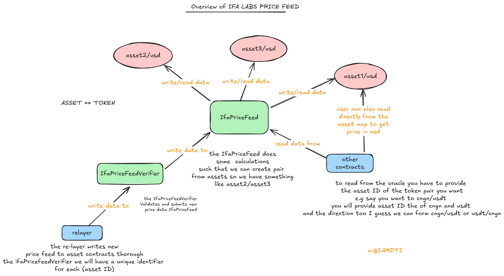

# IFA Oracle Price Feed System

A decentralized oracle solution specialized for stablecoin price data across various currencies (USDC, USDT, EURC, CNGN, etc.), providing accurate and transparent price information. The system stores individual asset prices and calculates exchange rates between any pair of stablecoins or other supported assets.
### Contract deployed on base sepolia at :
```shell
== Logs ==
  
  `IfaPriceFeed` deployed at: `0x863B19fc31f656323E07A725C780fbdFfc459CBc`
  `IfaPriceFeedVerifier` deployed at: `0x18669d2045B888f520ffaeF0Cb90E2E21485B247`
```
## Features

- Store and manage asset price information against USD
- Calculate exchange rates between any two assets
- Support for both forward (asset0/asset1) and backward (asset1/asset0) pair calculations
- Round tracking to ensure data freshness
- Decimal scaling for precision in calculations
- Role-based access control with verifier and relayer architecture

## Installation & Setup

1. Ensure you have Solidity 0.8.29 installed
2. Clone the repository
3. Install dependencies:
   ```shell
    forge soldeer install solady~0.1.14
    forge build
   ```

## Usage

The system operates through three main components:

1. **`IfaPriceFeed`** - Stores price data and calculates pair exchange rates
2. **`IfaPriceFeedVerifier`** - Validates and submits new price data
3. Relayer Node (external component) - Collects and submits price data

### Deployment Flow

1. Deploy the **`IfaPriceFeed`** contract
2. Deploy the **`IfaPriceFeedVerifier`** contract with references to the relayer node and price feed contract
3. Call `IfaPriceFeed::setVerifier` to link the verifier contract
> see script/DeployPriceFeed.sol
### Basic Usage Example

``` solidity
// Deploy contracts
IfaPriceFeed priceFeed = new IfaPriceFeed();
IfaPriceFeedVerifier verifier = new IfaPriceFeedVerifier(relayerNodeAddress, address(priceFeed));

// Set verifier in price feed
priceFeed.setVerifier(address(verifier));

// Submit price data (called by relayer node)
bytes32[] memory assetIndexes = new bytes32[](2);
assetIndexes[0] =  keccak256("CNGN"); // CNGN/USD
assetIndexes[1] =  keccak256("BTC"); // BTC/USD

IIfaPriceFeed.PriceFeed[] memory prices = new IIfaPriceFeed.PriceFeed[](2);
prices[0] = IIfaPriceFeed.PriceFeed({decimal: -18, lastUpdateTime: block.timestamp, price: 2200000000000000000000000000, roundId: 1});
prices[1] = IIfaPriceFeed.PriceFeed({decimal: -18, lastUpdateTime: block.timestamp, price: 68000000000000000000000000000000, roundId: 1});

verifier.submitPriceFeed(assetIndexes, prices);

// Get exchange rate (CNGN/BTC)
(IIfaPriceFeed.DerviedPair memory pair) = priceFeed.getPairbyId(keccak256("CNGN"),  keccak256("BTC"), IIfaPriceFeed.PairDirection.Forward);
```

## Code Structure / Architecture

The system follows a multi-layered architecture:

1. **Data Layer**: Asset price storage in the **`IfaPriceFeed`** contract
2. **Validation Layer**: Price verification through the **`IfaPriceFeedVerifier`** contract
3. **Access Control Layer**: Role-based permissions (owner, verifier, relayer)
4. **Interface Layer**: External interaction through `IIfaPriceFeed` interface



## Contracts / Modules
> Note: the assets ID here are just for example purpose
### **`IIfaPriceFeed`** (Interface)

Defines the structure and functionality for the price feed system.

#### Key Structures:

- **`PriceFeed`**: Stores individual asset price information
  - `decimal`: Decimal precision of the price
  - `lastUpdateTime`: Timestamp of last update
  - `price`: Current price value
  - `roundId`: Current round identifier

- **`DerviedPair`**: Represents exchange rate between two assets
  - `decimal`: Always set to MAX_DECIMAL_NEGATIVE (-30)
  - `lastUpdateTime`: Min timestamp of the two assets
  - `derivedPrice`: Calculated exchange rate
  - `roundDifference`: Difference between round IDs

- **`PairDirection`**: Enum for specifying direction
  - `Forward`: asset0/asset1
  - `Backward`: asset1/asset0

### **`IfaPriceFeed`** (Implementation)

Main contract for storing asset prices and calculating exchange rates.

#### Key Constants:

- `MAX_DECIMAL`:          Set to 30 for high precision in calculations
- `MAX_DECIMAL_NEGATIVE`: Set to -30 for high precision in calculations

### **`IfaPriceFeedVerifier`**

Contract that validates and submits price data from the relayer.

## Functions Overview

### **`IfaPriceFeed`** Contract

#### `IfaPriceFeed::getAssetInfo`
- **Visibility:** `external view`
- **Inputs:** `bytes32 _assetIndex`
- **Outputs:** `(PriceFeed memory assetInfo, bool exist)`
- **Description:** Returns price information for a specific asset identified by its index.
- **Example:**
```solidity
(IIfaPriceFeed.PriceFeed memory btcInfo, bool exists) = priceFeed.getAssetInfo( keccak256("BTC"));
```

#### `IfaPriceFeed::getAssetsInfo`
- **Visibility:** `external view`
- **Inputs:** `bytes32[] calldata _assetIndexes`
- **Outputs:** `(PriceFeed[] memory assetsInfo, bool[] memory exists)`
- **Description:** Retrieves price information for multiple assets in a single call.
- **Example:**
```solidity
bytes32[] memory assets = new bytes32[](2);
assets[0] = keccak256("CNGN"); // CNGN/USD
assets[1] = keccak256("BTC"); // BTC/USD
(IIfaPriceFeed.PriceFeed[] memory info, bool[] memory exist) = priceFeed.getAssetsInfo(assets);
```

#### `IfaPriceFeed::getPairbyId`
- **Visibility:** `external view`
- **Inputs:** `bytes32 _assetIndex0, bytes32 _assetIndex1, PairDirection _direction`
- **Outputs:** `DerviedPair memory pairInfo`
- **Description:** Calculates the exchange rate between two assets in the specified direction.
- **Example:**
```solidity
// Get CNGN/BTC rate
IIfaPriceFeed.DerviedPair memory pair = priceFeed.getPairbyId(
  keccak256("CNGN"), // CNGN/USD
  keccak256("BTC"), // BTC/USD
  IIfaPriceFeed.PairDirection.Forward
);
```

#### `IfaPriceFeed::getPairsbyIdForward`
- **Visibility:** `external view`
- **Inputs:** `bytes32[] calldata _assetIndexes0, bytes32[] calldata _assetsIndexes1`
- **Outputs:** `DerviedPair[] memory pairsInfo`
- **Description:** Batch calculation of exchange rates between multiple asset pairs in forward direction.
- **Example:**
```solidity
bytes32[] memory assets0 = new bytes32[](2);
bytes32[] memory assets1 = new bytes32[](2);
assets0[0] = keccak256("CNGN"); // CNGN/USD
assets0[1] = keccak256("ETH"); // ETH/USD
assets1[0] = keccak256("BTC"); // BTC/USD
assets1[1] = keccak256("USDT"); // USDT/USD
IIfaPriceFeed.DerviedPair[] memory pairs = priceFeed.getPairsbyIdForward(assets0, assets1);
// Returns [CNGN/BTC, ETH/USDT]
```

#### `IfaPriceFeed::getPairsbyIdBackward`
- **Visibility:** `external view`
- **Inputs:** `bytes32[] calldata _assetIndexes0, bytes32[] calldata _assetsIndexes1`
- **Outputs:** `DerviedPair[] memory pairsInfo`
- **Description:** Batch calculation of exchange rates between multiple asset pairs in backward direction.
- **Example:**
```solidity
bytes32[] memory assets0 = new bytes32[](2);
bytes32[] memory assets1 = new bytes32[](2);
assets0[0] = keccak256("CNGN"); // CNGN/USD
assets0[1] = keccak256("ETH"); // ETH/USD
assets1[0] = keccak256("BTC"); // BTC/USD
assets1[1] = keccak256("USDT"); // USDT/USD
IIfaPriceFeed.DerviedPair[] memory pairs = priceFeed.getPairsbyIdBackward(assets0, assets1);
// Returns [BTC/CNGN, USDT/ETH]
```

#### `IfaPriceFeed::getPairsbyId`
- **Visibility:** `external view`
- **Inputs:** `bytes32[] calldata _assetIndexes0, bytes32[] calldata _assetsIndexes1, PairDirection[] calldata _direction`
- **Outputs:** `DerviedPair[] memory pairsInfo`
- **Description:** Batch calculation with custom direction for each pair.
- **Example:**
```solidity
bytes32[] memory assets0 = new bytes32[](2);
bytes32[] memory assets1 = new bytes32[](2);
IIfaPriceFeed.PairDirection[] memory directions = new IIfaPriceFeed.PairDirection[](2);

assets0[0] = keccak256("CNGN") // CNGN/USD
assets1[0] = keccak256("BTC"); // BTC/USD
directions[0] = IIfaPriceFeed.PairDirection.Forward;

assets0[1] = keccak256("ETH"); // ETH/USD
assets1[1] = keccak256("USDT"); // USDT/USD
directions[1] = IIfaPriceFeed.PairDirection.Backward;

IIfaPriceFeed.DerviedPair[] memory pairs = priceFeed.getPairsbyId(assets0, assets1, directions);
// Returns [CNGN/BTC, USDT/ETH]
```

#### `IfaPriceFeed::setAssetInfo`
- **Visibility:** `external`
- **Inputs:** `bytes32 _assetIndex, PriceFeed calldata assetInfo`
- **Outputs:** None
- **Description:** Sets price information for an asset (only callable by the verifier).
- **Example:**
```solidity
// Can only be called by the verifier contract
priceFeed.setAssetInfo(
    keccak256("CNGN"), // CNGN/USD
    IIfaPriceFeed.PriceFeed({
        decimal: -18,
        lastUpdateTime: block.timestamp,
        price: 2200000000000000000000000000,
        roundId: 1
    })
);
```

#### `IfaPriceFeed::setVerifier`
- **Visibility:** `external`
- **Inputs:** `address _verifier`
- **Outputs:** None
- **Description:** Sets the verifier contract address (only callable by owner).
- **Example:**
```solidity
priceFeed.setVerifier(address(verifierContract));
```

### **`IfaPriceFeedVerifier`** Contract

#### `IfaPriceFeedVerifier::submitPriceFeed`
- **Visibility:** `external`
- **Inputs:** `bytes32[] calldata _assetindex, IIfaPriceFeed.PriceFeed[] calldata _prices`
- **Outputs:** None
- **Description:** Submits new price data for multiple assets (only callable by relayer node).
- **Example:**
```solidity
bytes32[] memory assetIndexes = new bytes32[](2);
assetIndexes[0] = keccak256("CNGN"); // CNGN/USD
assetIndexes[1] = keccak256("BTC"); // BTC/USD

IIfaPriceFeed.PriceFeed[] memory prices = new IIfaPriceFeed.PriceFeed[](2);
prices[0] = IIfaPriceFeed.PriceFeed({decimal: -18, lastUpdateTime: block.timestamp, price: 2200000000000000000000000000, roundId: 1});
prices[1] = IIfaPriceFeed.PriceFeed({decimal: -18, lastUpdateTime: block.timestamp, price: 68000000000000000000000000000000, roundId: 1});

verifier.submitPriceFeed(assetIndexes, prices);
```

#### `IfaPriceFeedVerifier::setRelayerNode`
- **Visibility:** `external`
- **Inputs:** `address _relayerNode`
- **Outputs:** None
- **Description:** Sets the relayer node address (only callable by owner).
- **Example:**
```solidity
verifier.setRelayerNode(newRelayerAddress);
```


.

